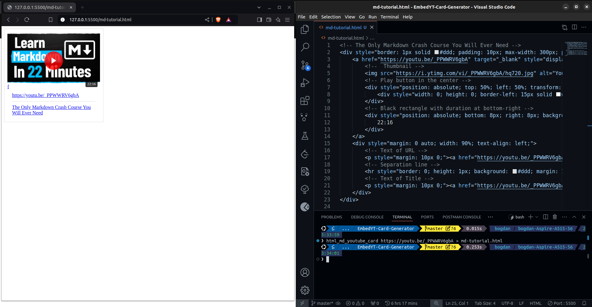

# Embed YouTube Card Generator

> **CLI** tool to create embedded YouTube cards for HTML/MarkDown projects.
>
> Bring your YouTube links to life!


🤖 Automate the boring stuff with Python!


🚀 Glow up your HTML/Markdown files with this simple Python script!
Just provide a YouTube URL as input, and it generates a sleek, clickable YouTube card for you.
Perfect for embedding videos in your blog, documentation, or personal projects.

This card comes with:

- 📺 An automatically generated thumbnail from the YouTube video.
- ▶️ A bold play button right in the center.
- 🔗 A clickable link to the video (both on the image and as text below).


## Preview/Results





## Why use it?


If you want to make your HTML/Markdown files stand out and look clean,
this is exactly what you need!

No need to wrestle with complex embeds—this card is lightweight, visually appealing, and super easy to implement.


## What do you get?

Clean, ready-to-use HTML that you can drop anywhere:

```html
<!-- Markdown Crash Course - Beginner Tutorial -->
<div style="border: 1px solid #ddd; padding: 10px; max-width: 300px; position: relative; display: inline-block;">
        <a href="https://youtu.be/34_dRW42kYI" target="_blank" style="display: block; position: relative;">
                <!--  Thumbnail -->
                
                <!-- Play button in the center -->
                <div style="position: absolute; top: 50%; left: 50%; transform: translate(-50%, -50%); width: 60px; height: 60px; background: rgba(255, 0, 0, 0.8); border-radius: 50%; display: flex; align-items: center; justify-content: center;">
                        <div style="width: 0; height: 0; border-left: 15px solid white; border-top: 10px solid transparent; border-bottom: 10px solid transparent;"></div>
                </div>
                <!-- Black rectangle with duration at bottom-right -->
                <div style="position: absolute; bottom: 8px; right: 8px; background: rgba(0, 0, 0, 0.8); color: white; padding: 2px 6px; font-size: 12px; border-radius: 3px;">
                        21:24
                </div>
        </a>
        <div style="margin: 0 auto; width: 90%; text-align: left;">
                <!-- Text of URL -->
                <p style="margin: 10px 0;"><a href="https://youtu.be/34_dRW42kYI" target="_blank">https://youtu.be/34_dRW42kYI</a></p>
                <!-- Separation line -->
                <hr style="border: 0; height: 1px; background: #ddd; margin: 10px 0;">
                <!-- Text of Title -->
                <p style="margin: 10px 0;"><a href="https://youtu.be/34_dRW42kYI" target="_blank">Markdown Crash Course - Beginner Tutorial</a></p>
        </div>
</div>

```


## My Personal Motivation

✨ **I set out to bring boring, lifeless links in Markdown to life!** ✨

We've all seen those plain YouTube links in `.md` files that do nothing to grab attention.
My goal was to create a more engaging and visually appealing way to embed YouTube videos in Markdown files. With this script, those bland URLs transform into clickable, attractive YouTube cards that stand out.

When working with Markdown files, the results really shine when viewed with tools like:

- 🖼️ [`Markdown Preview Enhanced`](https://marketplace.visualstudio.com/items?itemName=shd101wyy.markdown-preview-enhanced) - great for local previews while you're editing.
- 📄 [`Markdown PDF`](https://marketplace.visualstudio.com/items?itemName=yzane.markdown-pdf) `+` [`PDF Viewer`](https://marketplace.visualstudio.com/items?itemName=tomoki1207.pdf) - perfect for exporting your Markdown into a professional-looking PDF.

> Note: On `GitHub`, the cards won't render as beautifully
> due to `GitHub`'s restrictions on custom HTML rendering.
> But locally and in PDFs, they look amazing, they will **shine**! 🌟


## Description

This Python script is a **CLI tool**
that aims to generate HTML/MarkDown code
for a **clickable YouTube card**.


It will take a single argument in the command line,
the `URL`, representing the link to the YouTube Video/Short.


The script uses `pytube` module to automatically get
relevant data regarding the clip, including:
- Thumbnail
- Title
- Duration


The generated code will render a YouTube clip that will include a thumbnail,
containing a white arrow in red circle.
The text of the URL will be rendered above the title, both being splittted by a line,
and aligned to the left.
The HTML/MD code will also include relevant comments.


> A **default** version for <https://github.com/TrifanBogdan24/Customizable-EmbedYT-Card-Generator.git>


## Dependencies

This tool uses the `pytube` module.


```bash
$ pip3 install pytube    # getting YouTube clip info
```


> IMPORTANT NOTE:
>
> Given the numerous problems and errors caused by the `pytube` module,
> please check this link <https://github.com/pytube/pytube/issues/2059>,
> my project now uses the `pytubefix` module.
>
> The `pytubefix` module's documentation is available on the GitHub page,
> at the following link: <https://github.com/JuanBindez/pytubefix.git>.


```bash
$ pip3 install pytubefix
```


Also, when running the `html_md_yt_card` **CLI tool** for the first time,
it **might** ask for authentication on Google.
Without authentication, you'll be seen as a bot and an error message will be dispalyed.


## Installation


Please see [install.sh](install.sh).


Run the following command in the `Linux` terminal:
```bash
$ chmod +x html_md_youtube_card.py
$ sudo cp html_md_youtube_card.py /usr/local/bin/html_md_youtube_card
```


## Uninstall

You can use the script [uninstall.sh](uninstall.sh).


```bash
$ sudo rm -i /usr/local/bin/html_md_youtube_card
```


## How to use it?

```bash
# Show help output
$ html_md_youtube_card -h
$ html_md_youtube_card --help


$ html_md_youtube_card $URL 
$ html_md_youtube_card --url=$URL


# This tool is more powerfull when used with redirection
$ html_md_youtube_card $URL > READ-ME.md
$ html_md_youtube_card $URL >> READ-ME.md
$ html_md_youtube_card --url=$URL > READ-ME.md
$ html_md_youtube_card --url=$URL >> READ-ME.md
```


> `--url=`
> This option expects a value after the **equal sign**,
> the URL of the YouTube clip.


## How to Run Using Python | An Alternative Approach


```bash
# Show help output
$ python3 html_md_youtube_card.py -h
$ python3 html_md_youtube_card.py --help


$ python3 html_md_youtube_card.py $URL 
$ python3 html_md_youtube_card.py --url=$URL


# This tool is more powerfull when used with redirection
$ python3 html_md_youtube_card.py $URL > READ-ME.md
$ python3 html_md_youtube_card.py $URL >> READ-ME.md
$ python3 html_md_youtube_card.py --url=$URL > READ-ME.md
$ python3 html_md_youtube_card.py --url=$URL >> READ-ME.md
```


## My advice on how to use it


- STEP 1: **Redirect** the output of the `html_md_youtube_card` **CLI tool** to a temporary file

```bash
$ html_md_youtube_card https://www.youtube.com/shorts/Nl9pcj79byY?feature=share > tmp.md
```


- STEP 2: Copy the content of the temporary file (in this case - *tmp.md*) and paste it where you need it


- STEP 3: Remove the temporary file


```bash
$ rm -f tmp.md
```

> NOTE:
> 
> Give it more tries.
> It might not work as expected in the first place.


## Copying the output of the CLI tool directly to `clipboard`


An alternative approach for the above advice would to
use an additional **command line tool**, that
being **piped** the output of `html_md_youtube_card`,
it will copy it directly to **clipboard**.


On Linux, you can use `xclip`:
```bash
$ sudo apt-get install xclip


$ html_md_youtube_card $ULR | xclip -selection clipboard
$ python3 html_md_youtube_card.py $URL | xclip -selection clipboard


# It's a great ideea to alias it and place it in your configuration file
$ echo "alias clip='xclip -selection clipboard'" >> ~/.bashrc
$ source ~/.bahrc
$ type clip
```


On MacOS, you can use `pbcopy`:
```sh
$ html_md_youtube_card $URL | pbcopy
$ python3 html_md_youtube_card.py $URL | pbcopy
```


On Windows, you can use `clip`
```powershell
> html_md_youtube_card $URL | clip
> python3 html_md_youtube_card.py $URL | clip
```


> Source of inspiration: <https://medium.com/@brianislevu/navigating-with-the-keyboard-4528267ce6b3>
